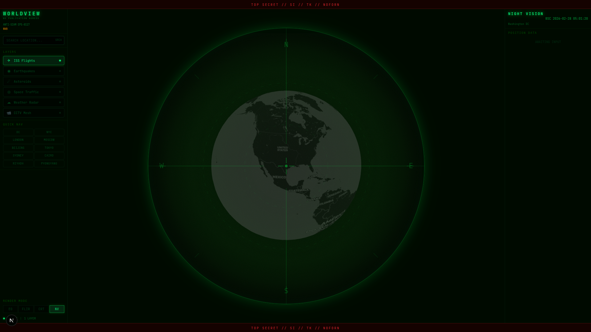
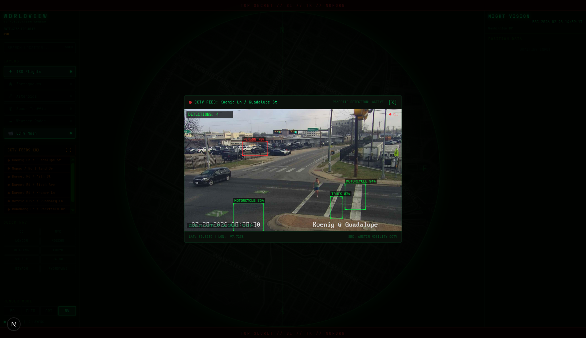

# WorldView OSS

An open-source real-time global intelligence dashboard built with Next.js 16, CesiumJS, and Tailwind CSS v4. View live flight traffic, satellite positions, earthquakes, asteroid trajectories, weather radar, and CCTV camera feeds — all rendered on a 3D globe through a military-grade "spy telescope" interface.



## Why This Exists

The original [WorldView](https://worldview.earth) project by [Bilawal Sidhu](https://x.com/bilawalsidhu) is a stunning piece of work. But it's closed source (at the time of writing). For a project built on top of open-source software — CesiumJS, Next.js, React, OpenSky Network, USGS feeds, CelesTrak, and countless other freely available APIs and libraries — keeping it proprietary is, frankly, a disservice to the community that made it possible in the first place.

Open source isn't just a license. It's a commitment to the ecosystem you benefit from. If your entire stack is open and the data you consume is public, your visualization layer shouldn't be locked behind a paywall or a waitlist.

**WorldView OSS is the answer.** Same concept, built from scratch, fully open. Fork it, extend it, learn from it, deploy it. That's the point.

## Features

- **3D Globe** — CesiumJS-powered interactive Earth with dark imagery tiles
- **Spy Telescope Layout** — Circular globe viewport with crosshairs, compass markers, and range rings
- **Live Data Layers**
  - ISS Flight Tracking (airplanes.live ADS-B data)
  - Satellite Positions (CelesTrak TLE data)
  - Earthquakes & Natural Disasters (USGS + NASA EONET)
  - Near-Earth Asteroids (NASA NeoWs API)
  - Weather Radar (OpenWeatherMap)
  - CCTV Camera Feeds — 3,000+ cameras across 10+ cities with 3-tier progressive clustering
  - YouTube Live Streams — geo-tagged live broadcasts
  - News Intel — geo-tagged articles from GDELT, RSS feeds, Reddit
  - Military Actions — GDELT-sourced conflict events with 5 sub-categories
- **Timeline Slider** — Scrub through historical data with calendar date picker
- **Mission Control** — AI-powered geographic intelligence gathering
  - Click the globe to set a deployment area + radius
  - Micro-agent pipeline: web search → per-item LLM extraction → streaming results
  - 4 specialized agents: News Scout, Military Analyst, Disaster Monitor, GEOINT Analyst
  - Per-agent controls: skip, pause, resume, cancel, editable system prompts
  - Live SSE log streaming with color-coded agent tags
  - Intel results panel with confidence scores and click-to-flyTo
  - GPU-accelerated: ~0.8s per micro-agent call on GPU, instant fallback on CPU
- **View Modes** — Electro-Optical, FLIR Thermal, CRT, Night Vision
- **Live CCTV Feeds** — Real traffic camera streams with simulated object detection overlay
- **CCTV Clustering** — City-level clusters at global zoom, individual cameras on zoom-in, feed previews at street level
- **Search** — Geocode any location and fly to it on the globe
- **Quick Nav** — One-click navigation to major world cities



## Tech Stack

| Layer | Technology |
|-------|-----------|
| Framework | Next.js 16 (Turbopack) |
| 3D Globe | CesiumJS |
| Styling | Tailwind CSS v4 + custom CSS |
| State | Zustand |
| Language | TypeScript |
| AI Agents | Ollama (local LLM) with lfm2 models |
| Knowledge Graph | JanusGraph + Cassandra (optional) |
| Data Sources | GDELT, USGS, NASA EONET/NeoWs, OpenWeatherMap, RSS (BBC, Al Jazeera), Reddit, airplanes.live, CelesTrak, 10+ DOT camera APIs |

## Getting Started

### Prerequisites

- Node.js 18+
- A [Cesium Ion](https://ion.cesium.com/) access token (free tier works)
- Optional: [NASA API key](https://api.nasa.gov/), [OpenWeatherMap API key](https://openweathermap.org/api)
- Optional: [Ollama](https://ollama.com/) for Mission Control AI agents (GPU recommended)

### Install

```bash
git clone https://github.com/jedijamez567/worldview_oss.git
cd worldview_oss
npm install
```

### Configure

Create a `.env.local` file:

```env
NEXT_PUBLIC_CESIUM_TOKEN=your_cesium_ion_token
NASA_API_KEY=your_nasa_api_key        # optional, falls back to DEMO_KEY
WEATHER_API_KEY=your_openweather_key  # optional
OLLAMA_HOST=http://127.0.0.1:11434   # optional, for Mission Control agents
```

### Run

```bash
npm run dev
```

Open the URL shown in the terminal (usually `http://localhost:3000`).

### Build

```bash
npm run build
```

## Project Structure

```
app/
  page.tsx              # Main 3-column layout
  globals.css           # Scope/telescope CSS, view mode effects
  api/                  # Next.js API routes (agents, military, news, cameras, etc.)
components/
  Globe.tsx             # CesiumJS globe (9 data layers + deployment layer)
  hud/                  # Header, Sidebar, InfoPanel, AgentPanel, TimelineSlider, etc.
  layers/               # Flight, Satellite, Disaster, Camera, Military, Deployment layers
  mission-control/      # MissionControlModal, AgentCard, MissionLog, MissionResults
  effects/              # View mode filters (NV, FLIR, CRT)
  ui/                   # Camera feed modal, media modal
hooks/
  useMissionControl.ts  # SSE connection + API actions for Mission Control
  useAgentSwarm.ts      # Legacy swarm polling
  useMilitary.ts        # Military actions data hook
stores/
  worldview-store.ts    # Zustand global state (layers, viewport, mission control)
lib/
  agents/               # Ollama client, micro-agents, mission executor, geo-context
  api/                  # Data fetching (cameras, RSS news, DuckDuckGo, etc.)
  graph/                # JanusGraph client, schema, queries, GKG ingestion
  camera-clusters.ts    # City-level clustering for CCTV cameras
  cesium-config.ts      # Cesium initialization
```

## Mission Control (AI Agents)

Mission Control deploys AI agents to a geographic area on the globe for targeted intelligence gathering.

1. Click **MISSION CONTROL** in the left panel (or click the globe in deployment mode)
2. Adjust the deployment radius (50km / 200km / 500km)
3. Optionally edit agent system prompts or skip agents
4. Click **DEPLOY ALL** to start the micro-agent pipeline

The pipeline searches the web for relevant intel, splits results into individual items, and runs each through a local LLM (via Ollama) for structured extraction. Results stream to the UI in real-time.

**Setup:**
```bash
# Install Ollama (https://ollama.com)
ollama pull sam860/lfm2:8b    # 5.9GB — fits 12GB VRAM
ollama serve                   # Start the server
```

The system auto-detects GPU availability. On GPU (~150 tok/s), a full 24-item mission completes in ~20 seconds. On CPU, it falls back to direct extraction without LLM (instant, lower quality). The app works fully without Ollama installed.

## Data Sources & Attribution

All data comes from publicly available APIs:

- **Flight Data**: [airplanes.live](https://airplanes.live/) — ADS-B Exchange community feed
- **Satellite TLEs**: [CelesTrak](https://celestrak.org/) — public satellite orbital data
- **Earthquakes & Disasters**: [USGS](https://earthquake.usgs.gov/) + [NASA EONET](https://eonet.gsfc.nasa.gov/) — real-time seismic + natural events
- **Asteroids**: [NASA NeoWs](https://api.nasa.gov/) — near-Earth object tracking
- **Weather**: [OpenWeatherMap](https://openweathermap.org/) — global weather data
- **News**: RSS feeds (BBC, Al Jazeera, France 24, PressTV), Reddit, [GDELT](https://www.gdeltproject.org/) knowledge graph
- **Military Events**: [GDELT GEO API](http://api.gdeltproject.org/) — geocoded conflict event data
- **AI Models**: [Ollama](https://ollama.com/) — local LLM inference (lfm2 preferred)
- **CCTV Feeds**: Aggregated from public DOT APIs across 10+ cities:
  - [Caltrans](https://cwwp2.dot.ca.gov/) — California (all districts, ~2,500+ cameras)
  - [City of Austin Mobility](https://data.austintexas.gov/) — Austin, TX
  - [WSDOT](https://data.wsdot.wa.gov/) — Seattle/Washington (ArcGIS FeatureServer)
  - [IDOT/Travel Midwest](https://travelmidwest.com/) — Chicago/Illinois (ArcGIS FeatureServer)
  - [Houston TranStar](https://traffic.houstontranstar.org/) — Houston, TX
  - [NV Roads](https://www.nvroads.com/) — Las Vegas/Nevada (Iteris 511)
  - [FL511](https://fl511.com/) — Orlando/Florida (Iteris 511)
  - [NYC DOT](https://webcams.nyctmc.org/) — New York City
  - [UK National Highways](https://www.trafficengland.com/) — London/UK
  - [HK Transport Dept](https://data.gov.hk/) — Hong Kong
- **Globe Tiles**: [CesiumJS](https://cesium.com/) — 3D geospatial platform (open source)

## License

MIT. Because that's how open source works.

## Contributing

PRs welcome. If you add a new data layer, fix a bug, or improve the UI — open a pull request. No CLA, no hoops.
